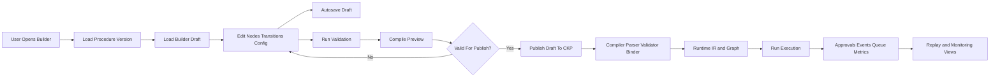
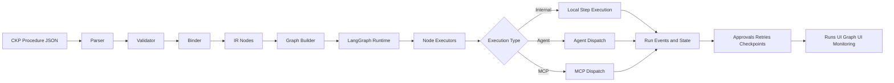
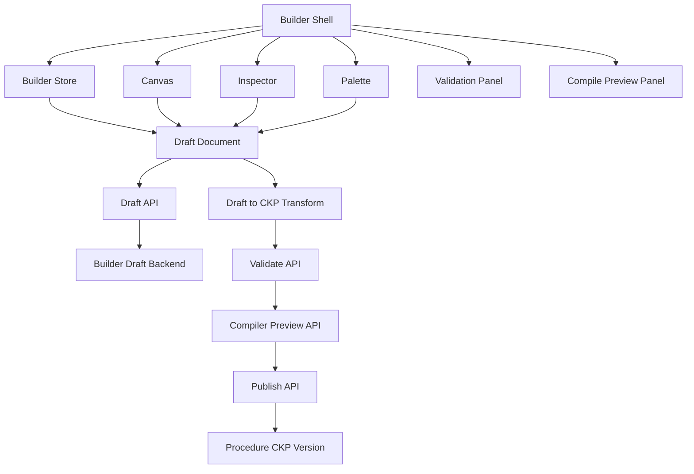
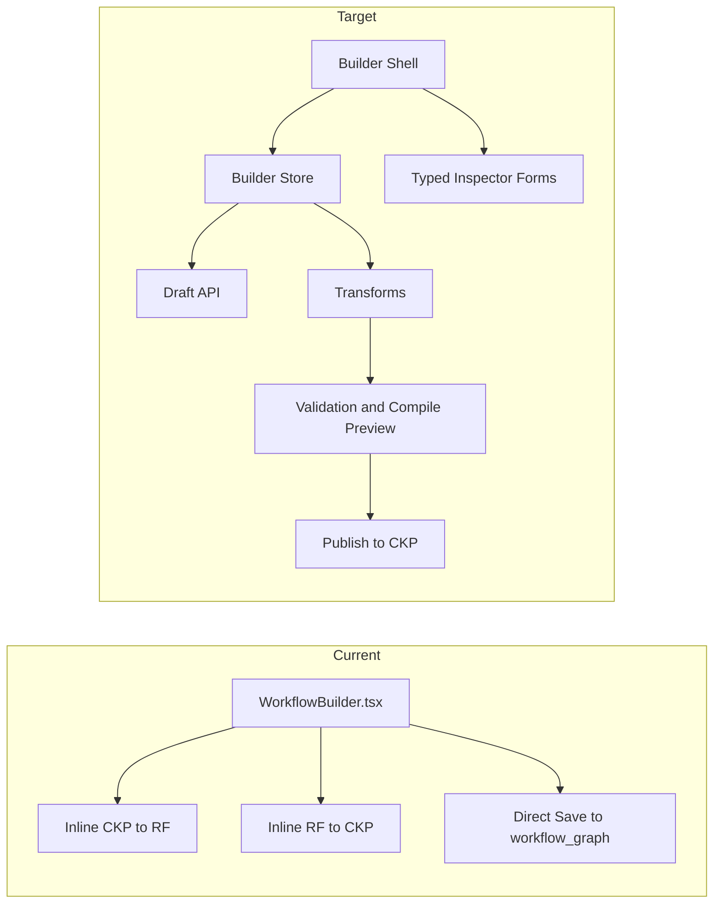
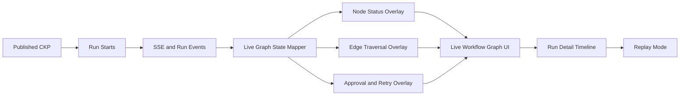
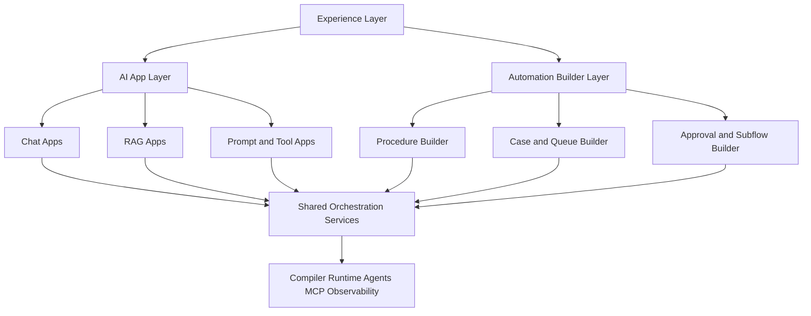

# LangOrch Visual Builder Rebuild Reference

Last updated: 2026-03-08

## 1. Why this file exists

This file is a working reference for rebuilding the LangOrch visual builder using the copied Dify codebase only as architectural input, not as a product template to clone.

The current LangOrch backend is already stronger than the builder UI. The next builder should therefore be designed around LangOrch's existing strengths:

- CKP as the canonical workflow contract
- compile/bind/execute architecture
- durable runtime and replay model
- case, queue, approval, and governance features
- multi-agent orchestration across WEB, DESKTOP, EMAIL, API, DATABASE, and LLM channels

The builder must make those capabilities easier to author without turning LangOrch into a Dify lookalike.

## 1.1 Visual flow

The rebuild should be understood as this authoring and execution flow:



This is the key model:

- the builder edits a draft
- the draft is validated and compile-previewed
- only then is it published into CKP
- CKP remains the execution contract

## 1.2 Current runtime flow

This is the current LangOrch procedure execution shape at a high level:



## 1.3 Target builder architecture

This is the recommended builder-v2 structure:



## 1.4 Current vs target

The rebuild is mainly a shift from a single-component editor to a layered authoring system:



## 2. What exists today

### LangOrch current reality

The current builder is usable as a proof of concept, but not as a long-term foundation.

Key observations from the current code:

- `frontend/src/components/WorkflowBuilder.tsx` is doing canvas rendering, palette logic, inspector rendering, CKP import/export, templates, edge semantics, and save orchestration in one large client component.
- `frontend/src/components/WorkflowBuilder.tsx` converts directly between CKP and React Flow (`ckpToRf`, `rfToCkp`), which means UI state and canonical workflow state are too tightly coupled.
- `frontend/src/app/procedures/[id]/[version]/page.tsx` saves by replacing `workflow_graph` directly inside the CKP document. That is functional, but it leaves no real draft model, autosave model, compile-preview model, or validation pipeline tailored for builder editing.
- `frontend/src/app/builder/page.tsx` is mainly a graph exploration page, not a full authoring product.
- `frontend/src/components/WorkflowGraph.tsx` is already useful as a runtime/read-only graph view and should remain separate from authoring.

### Dify reference patterns worth studying

Useful Dify patterns found in the copied reference:

- `dify-main-code-reference/web/app/components/workflow/index.tsx`: editor shell separated from specialized helpers and hooks.
- `dify-main-code-reference/web/app/components/workflow/store/workflow/workflow-slice.ts`: slice-based state management instead of one giant local-state component.
- `dify-main-code-reference/web/app/components/workflow/types.ts`: explicit workflow editor types for nodes, edges, runtime state, and UI state.
- `dify-main-code-reference/api/services/workflow_service.py`: draft workflow lifecycle is treated as a first-class backend concept.

## 3. Main problems to fix in LangOrch

### Builder architecture problems

1. The builder is monolithic.
2. The builder stores too much knowledge in one file.
3. CKP conversion is happening inline inside the authoring component.
4. The inspector edits raw graph fields too directly.
5. There is no builder draft lifecycle distinct from published procedure versions.
6. There is no server-backed compile preview for authoring feedback.
7. Validation is too late in the flow.

### Product problems

1. The authoring UX is still technical and node-centric instead of task-centric.
2. Non-expert users must understand raw node fields earlier than they should.
3. Advanced LangOrch features such as approvals, leases, callbacks, cases, queue semantics, SLA, retries, and subflows are not surfaced as guided authoring concepts.
4. The visual builder does not yet express LangOrch's core differentiator: deterministic + agentic + governed automation.

## 4. Recommendation summary

### Do not copy Dify directly

Do not port Dify's workflow DSL or try to make LangOrch behave like an LLM app builder.

Do not copy:

- Dify node taxonomy as the LangOrch canonical model
- Dify's app/chat/RAG-specific assumptions
- Dify's product framing around LLM apps as the primary abstraction

### Do copy these architectural ideas

Adopt these ideas from Dify's architecture:

- split editor shell, canvas, inspector, registry, and runtime panels
- use a dedicated store for editor state
- introduce a draft model in the backend
- define explicit editor types separate from runtime types
- register node types through a registry instead of hardcoding behavior throughout one file
- support validation and preview as first-class editor actions

## 5. Recommended target architecture

### Frontend structure

Create a new builder implementation under a new folder and keep the existing builder intact until feature parity is reached.

Recommended structure:

```text
frontend/src/builder-v2/
  api/
    draft-api.ts
  canvas/
    BuilderCanvas.tsx
    edge-policy.ts
    layout.ts
  components/
    BuilderShell.tsx
    DirtyStateBanner.tsx
  inspector/
    InspectorPanel.tsx
    forms/
      SequenceNodeForm.tsx
      LogicNodeForm.tsx
      LoopNodeForm.tsx
      ApprovalNodeForm.tsx
      LlmNodeForm.tsx
      TransformNodeForm.tsx
      SubflowNodeForm.tsx
  palette/
    NodePalette.tsx
    template-library.ts
  preview/
    CompilePreviewPanel.tsx
    ValidationPanel.tsx
    RunSimulationPanel.tsx
  registry/
    node-definitions.ts
  store/
    builder-store.ts
  transforms/
    ckp-to-draft.ts
    draft-to-ckp.ts
  types/
    builder-types.ts
```

### Backend structure

Add builder-specific backend capabilities instead of overloading procedure update endpoints.

Recommended additions:

- `builder_drafts` table for autosaved draft state
- `POST /api/builder/drafts` create or update draft
- `GET /api/builder/drafts/{procedure_id}/{version}` fetch draft
- `POST /api/builder/validate` run CKP validation without publishing
- `POST /api/builder/compile-preview` return IR summary, warnings, edge cases, and node execution preview
- `POST /api/builder/publish` validate, transform draft to CKP, and publish atomically

### Domain model rule

Use three distinct models:

1. CKP model
2. Builder draft model
3. Runtime/IR preview model

This separation is the most important change.

## 6. Builder data model recommendation

### Canonical rule

CKP remains the source of truth for execution.

The builder should not edit CKP objects directly in live component state. It should edit a builder draft that can be safely mapped to CKP.

### Builder draft model should include

- node identity and placement metadata
- visual grouping and comments
- inspector-friendly field structure
- validation warnings and unresolved references
- optional UX-only metadata that never goes into CKP unless mapped deliberately

### Example separation

```text
Builder Draft Node
  id
  kind
  title
  description
  position
  config
  transitions
  ui

CKP Node
  type
  description
  agent
  next_node / branches / rules / retry / timeout / payload fields
```

## 7. UX requirements for the rebuild

### UX direction

The new builder should feel like a product for operations teams and solution builders, not just engineers who already understand the CKP schema.

### Required UX capabilities

1. Guided node creation
2. Typed inspector forms by node kind
3. Draft autosave
4. Validation panel with errors and warnings tied to nodes
5. Compile preview before publish
6. Side-by-side source view for CKP power users
7. Read-only execution overlay using run data
8. Template starter flows for business use cases
9. Searchable variable and output picker
10. Publish flow with summary of runtime-impacting changes

### Live graph requirement

Yes, live graph is required and should be treated as a first-class product capability.

LangOrch should support two graph modes:

1. authoring graph
2. live execution graph

The live execution graph should not be an afterthought. It is one of the places where LangOrch can be stronger than simpler builder products because the runtime already has durable events, approvals, retries, and replay semantics.

### What live graph should show

The live graph should render runtime state on top of the workflow graph, including:

- current node
- completed nodes
- failed nodes
- paused approval nodes
- retrying nodes
- edge traversal counts
- last step executed
- last event timestamp
- run status and duration
- SLA breach state where relevant

### Data sources for live graph

The live graph should be fed by existing platform runtime data, primarily:

- run events
- SSE event stream
- approval state
- checkpoint and retry metadata
- case and queue metadata where applicable

### Recommended live graph behavior

1. During active run, graph updates in near real time from SSE.
2. During replay, graph animates from historical run events.
3. Clicking a node opens execution details for that node, not just node design config.
4. Clicking an edge shows how often that path was taken.
5. Approval nodes show pending approver, decision, and timeout state.
6. Failure nodes show error summary and retry history.
7. Live graph and timeline should stay synchronized.

### Architectural rule

Do not merge authoring and live graph into one overloaded component.

Recommended split:

- `WorkflowGraph` stays focused on execution and monitoring views
- `builder-v2` stays focused on authoring and publishing
- both can share layout utilities and graph metadata, but not the entire interaction model

### Live graph visual flow



### LangOrch-specific UX that Dify does not give us

The builder should surface LangOrch-first concepts explicitly:

- case queue inputs and queue outputs
- approval gates and escalation paths
- callback timeouts and DLQ behavior
- resource key and concurrency semantics
- subflow reuse
- run retry and resume semantics
- deployment channel impact

## 8. Immediate improvement recommendations for the current codebase

These changes should happen even before the full rebuild.

### P0

1. Extract `ckpToRf` and `rfToCkp` from `frontend/src/components/WorkflowBuilder.tsx` into dedicated transformer modules.
2. Extract node form sections into per-node inspector components.
3. Move palette definitions and templates into separate files.
4. Add a builder-level validation step before `onSave`.
5. Preserve the current builder only as `builder-legacy` once the new module starts.

### P1

1. Add backend draft persistence for builder editing.
2. Add compile-preview endpoint that returns validation warnings and IR summary.
3. Add node registry metadata from backend catalogs so the builder can generate forms from supported action metadata.
4. Add version diff for workflow graph changes before save or publish.

### P2

1. Add autosave and dirty-state recovery.
2. Add collaborative-safe draft locking semantics.
3. Add execution replay overlay directly in the new builder shell.
4. Add template packs for claims, invoice processing, approvals, queue-based dispatch, and human-review workflows.

## 9. Broader codebase improvement recommendations beyond the builder

### Backend

1. Introduce explicit builder APIs instead of overloading generic procedure updates.
2. Expose validator and compiler preview responses in a UI-friendly schema.
3. Add backend metadata endpoints for node capabilities, action catalogs, default config, and field schemas.
4. Separate builder-draft lifecycle from procedure release lifecycle.

### Frontend

1. Split runtime graph view from authoring graph view permanently.
2. Create dedicated frontend types for builder state rather than using loosely shaped `Record<string, unknown>` everywhere.
3. Centralize API typing for builder endpoints.
4. Keep `WorkflowGraph` focused on run visualization and move authoring concerns to `builder-v2`.

### Product

1. Make the builder workflow task-first, not graph-first.
2. Make variable mapping discoverable.
3. Add publish safety checks for approvals, retries, secrets, and callbacks.
4. Make reusable subflows a first-class authoring concept.

## 10. How to extend LangOrch toward Dify-like features

Yes, LangOrch can be extended toward Dify-like capabilities, but it should be done as an additional product layer, not by replacing the automation core.

### The important architectural decision

Do not turn the CKP orchestration model into a generic chat-app DSL.

Instead, keep this separation:

1. LangOrch core remains the durable automation and orchestration platform.
2. Dify-like features are added as an AI application layer on top of that platform.

That means LangOrch can support both:

- automation-first workflows
- AI-app-first workflows

without weakening either model.

### What Dify-like features actually mean

If you want Dify-like capabilities, the main missing product areas are:

- prompt-first app authoring
- chat assistant and agent experiences
- knowledge base and RAG pipelines
- dataset indexing and retrieval configuration
- tool marketplace and tool wiring
- app publishing as API or chat surface
- conversation memory and session management
- multi-tenant AI workspace model

### What should stay LangOrch-native

These should remain core LangOrch strengths and not be collapsed into a Dify clone:

- durable orchestration
- case and queue operations
- human approvals
- callback and retry semantics
- agent pool and lease control
- release governance
- replay and operational visibility

### Recommended target model

Use a layered product model:



### Practical implementation approach

Do this in phases.

#### Phase A: keep builder-v2 automation-first

Finish the automation builder rebuild first.

Why:

- current product strength is orchestration
- current gaps are mostly authoring UX and draft lifecycle
- rebuilding the base editor first gives a stable foundation

#### Phase B: add an AI app model beside CKP

Add a second, higher-level authoring contract for AI applications.

Suggested concept:

- `AppSpec` for chat, agent, and RAG apps
- `CKP` remains for operational procedures

Example model split:

```text
AppSpec
  app_type
  model_config
  prompt_config
  knowledge_sources
  tools
  conversation_settings
  publication_settings

CKP
  trigger
  workflow_graph
  retries
  approvals
  callbacks
  subflows
  runtime controls
```

Then provide a compiler path:

- `AppSpec -> generated CKP or generated runtime plan`

This is safer than forcing CKP itself to become a chat-builder schema.

#### Phase C: add Dify-like product surfaces

Add these as separate surfaces in the frontend:

- AI App Builder
- Prompt Studio
- Knowledge Base Manager
- Tool Catalog
- App Publish Console
- Chat Playground

### Backend capabilities needed for Dify-like expansion

If LangOrch wants Dify-like coverage, backend additions should include:

1. dataset and document ingestion services
2. embedding and retrieval pipeline services
3. conversation/session state model
4. prompt template registry with versioning
5. tool definition registry for app-facing tools
6. app publication and API surface layer
7. tenant and workspace isolation model

### Frontend capabilities needed for Dify-like expansion

Frontend additions would likely include:

1. chat app builder UI
2. prompt editor with testing sandbox
3. retrieval configuration UI
4. knowledge source management UI
5. tool connection UI
6. app preview and conversation simulator
7. publish screen for API, web app, or internal assistant exposure

### Product strategy recommendation

The strongest strategy is not to compete with Dify by imitation.

The stronger strategy is:

1. keep LangOrch as the serious orchestration and automation core
2. add Dify-like AI application features as a new layer
3. connect AI apps to LangOrch procedures, approvals, queues, and subflows

That would create a product that can do more than Dify in enterprise operations contexts.

### Concrete recommendation

If this roadmap matters, the right order is:

1. rebuild builder-v2 for automation
2. add draft, compile-preview, and live graph foundations
3. define `AppSpec` as a separate AI app contract
4. build prompt, RAG, and chat surfaces on top of shared orchestration services

That gives LangOrch a clean path to Dify-like features without corrupting the current architecture.

## 11. Recommended implementation order

### Phase 1: foundation

- create `builder-v2` folder
- define builder draft types
- extract CKP transforms
- create store and registry
- build shell, palette, canvas, and inspector skeleton

### Phase 2: authoring correctness

- typed forms for all supported LangOrch node kinds
- validation panel
- draft autosave
- compile preview

### Phase 3: publish and governance

- draft vs published workflow lifecycle
- diff and change summary
- publish flow with validation gate
- release-channel awareness

### Phase 4: operational intelligence

- execution overlays
- run replay on graph
- node metrics and hot-path annotations
- queue and approval insights in authoring

## 12. Concrete rebuild decision

The correct move is not to keep extending `frontend/src/components/WorkflowBuilder.tsx` forever.

The correct move is:

1. keep current builder working as legacy
2. start `builder-v2` as a separate module
3. add builder draft APIs in backend
4. keep CKP canonical
5. borrow Dify's editor architecture patterns, but keep LangOrch's orchestration identity

That gives LangOrch a builder that is more usable without weakening the platform's core model.

## 13. What is still missing before building

Before proceeding with a serious rebuild, a few things should be made explicit.

### Product decisions still needed

1. Define the primary builder audience for phase 1.
2. Decide whether phase 1 is for business operators, solution builders, or technical admins.
3. Define which node types are truly supported for guided editing in v1.
4. Decide whether draft publishing is procedure-version based only, or draft plus release-channel aware.
5. Decide whether AI-app features are out of scope for builder-v2 phase 1.

### Scope boundaries still needed

Phase 1 should not try to solve everything.

Recommended phase-1 scope:

- procedure authoring
- draft autosave
- typed node forms
- validation panel
- compile preview
- publish flow
- live graph read-only integration

Recommended phase-1 exclusions:

- full collaborative editing
- multi-user simultaneous builder sessions
- complete Dify-like AI app studio
- marketplace and template ecosystem
- full tenant-aware workspace authoring model

### Technical artifacts still needed

Before implementation, create these small foundation documents or contracts:

1. node definition registry contract
2. builder draft API schema
3. compile-preview response schema
4. live-graph state mapper contract
5. v1 node support matrix

## 14. Will business users like it?

Not yet, unless the rebuild is shaped for them explicitly.

The current direction is technically stronger, but business users will only like it if the product reduces workflow-authoring anxiety.

### The current risk

If the rebuilt builder still looks like a graph editor with technical forms, business users will not like it enough.

They may tolerate it for demos, but they will not confidently author production flows.

### What business users usually want

Business and operations users usually want:

- plain-language step labels
- guided setup instead of raw JSON thinking
- safe defaults
- visible approval and escalation paths
- clear explanations of what happens next
- confidence before publish
- templates that resemble real business processes
- fewer low-level fields shown by default

### What they usually do not want

- too many graph semantics upfront
- raw schema terminology everywhere
- too many retry, timeout, mapping, and condition fields shown at once
- unexplained runtime terminology
- a UI that feels like a developer tool first

## 15. Business-friendly acceptance criteria

The builder should be considered business-friendly only if these are true.

### Authoring experience

1. A non-technical user can create a basic approval workflow from a template without reading CKP.
2. A user can understand what each node does from the title and summary alone.
3. The inspector defaults to simple mode and hides advanced fields unless expanded.
4. Variables and outputs can be selected from pickers, not typed from memory.
5. Errors explain what is wrong in business language, not only technical language.

### Safety experience

1. Publish flow shows a change summary.
2. Validation warnings are grouped by severity.
3. Approval and timeout paths are visually obvious.
4. Users can preview likely execution paths before publishing.
5. Dangerous changes are highlighted before release.

### Monitoring experience

1. Live graph clearly shows where the run is stuck.
2. Approval waits are visually obvious.
3. Failures show human-readable summaries.
4. Replay mode explains what happened, not just where the graph moved.

## 16. Friendly-enough design recommendation

If the target is business adoption, the builder should not be a single-mode power-user tool.

It should have two levels of complexity:

1. simple mode for business users
2. advanced mode for technical builders

### Simple mode should emphasize

- templates
- business labels
- step summaries
- visual paths
- guided forms
- publish checks

### Advanced mode should expose

- retry policies
- timeout tuning
- mapping details
- expression editing
- agent routing and advanced runtime controls

## 17. Practical recommendation before proceeding

Yes, you can proceed with building, but only if you treat these as explicit requirements:

1. builder-v2 is automation-first
2. live graph is first-class
3. business-friendly simple mode is part of v1, not a later nice-to-have
4. advanced runtime controls are progressively disclosed
5. typed drafts and compile preview are mandatory foundations

If those are not built in, the result may be technically good but still not liked by business users.

See also:

- `BUSINESS_BUILDER_V1_REQUIREMENTS.md` for the business-user acceptance target, required screens, and phase-1 UX rules.

## 18. Proceed decision

Proceed with the rebuild, but use this order:

1. lock business-user v1 requirements
2. scaffold builder-v2 architecture
3. extract transforms from the legacy builder
4. add draft, validation, and compile-preview foundations
5. add live graph integration

That sequence reduces the risk of building a technically correct but product-weak editor.

